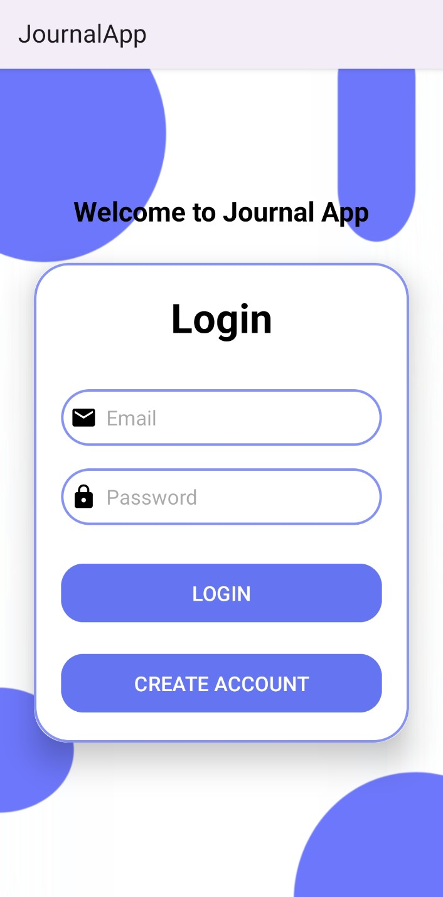
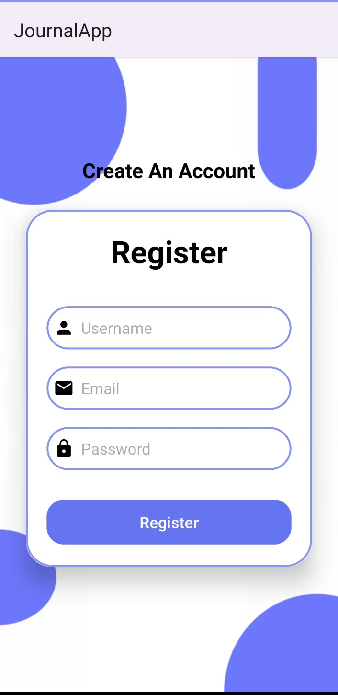
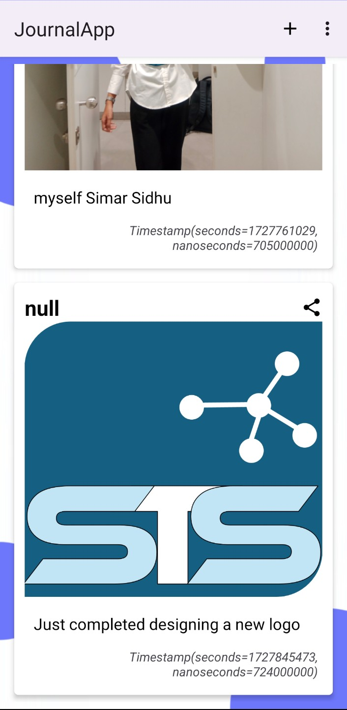
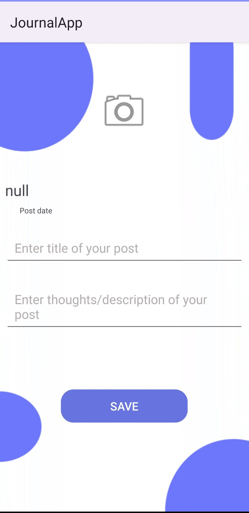

Journal App

This is a full-stack Android application built using Kotlin and Firebase, leveraging Cloud Firestore for real-time data storage, Firebase Storage for storing images, and Firebase's built-in authentication system for email-password login and registration.

Key Features:
- User Authentication: Users can register and log in using their email and password. The authentication is securely managed by Firebase Authentication.
- Journal Creation: Users can create new journal entries by uploading photos, entering a title, writing a description of their thoughts, and adding a timestamp to record when the entry was made.
- Cloud Storage Integration: Photos and journal entries are uploaded and stored in Firebase Storage and Cloud Firestore, making it possible to access your journals from anywhere and across devices.
- Dashboard: The app features a dashboard that allows users to view their previously created journals. Entries are displayed with their corresponding title, description, image, and the date they were created, providing a nostalgic way to revisit memories.
- Share and Delete Journal Entries: Users can share or delete existing journal entries, giving them full control over their stored content.
- Data Binding and Glide: The app uses data binding for efficient UI updates, and Glide is integrated for seamless image loading and caching.

Technology Stack:
- Kotlin: The primary programming language for the Android app.
- Firebase Authentication: For secure user login and registration using email-password.
- Cloud Firestore: To store journal entries (text and timestamp).
- Firebase Storage: For storing uploaded images.
- RecyclerView: Used to display a list of journal entries in a scrollable format.
- Glide: For loading and displaying images from Firebase Storage efficiently.
- Data Binding: For simplifying the UI management and improving app performance.

TO RUN locally:
Enter your personal api key at app/google-services.json file

Layout:
#### Login Page:

#### Register Page:

#### Dashboard Page:

#### Add Journal Entry:

